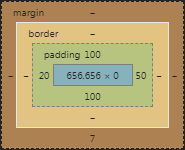

# Template

Basic CSS and JS development kit based on Bootstrap 4. Most of the classes can be applied to any BS4-compatible breakpoint (like classes `.fs-20` and `.fs-md-20`) as well as BS4's classes.

## Usage

Include files contained in `dist` folder to your page.

Note, that if you want build this files by yourselves then you need to install these utilities and add them to PATH variable:
- [uglify-js](https://www.npmjs.com/package/uglify-js) for Node.js
- [sass](https://rubygems.org/gems/sass/versions/3.4.22) gem for Ruby
Then run `build.bat` from command line.

## Description

All elements on the page have next styles by default:

```CSS
position: relative;
box-sizing: border-box;
background-repeat: no-repeat;
background-position: center;
```

All tables on the page have next styles by default:
```CSS
border-collapse: collapse;
```

## Main classes

Main classes are used to make main issues like button appearance complete.

| Class | Description |
| --- | --- |
| .float | Prevents element from collapsing when applied to element that has floating children |
| .clear | Clears any float values |
| .circle | Transforms an element to circle form |
| .cp | Applies `cursor: pointer` to an element |
| .nolink | Removes any underlines from links |
| .crop | Crops any overflowed content |
| .bg-default | Places background image of an element to the center and makes its size to cover the element |
| .fixed | When applied to `<header>` element makes it pinned to the top of the page. When applied to `<body>`, then it has the same effect as `.crop` class applied to it. Otherwise does nothing |
| .table-wrapper | Should be applied as parent relative to a `<table>`. If table overflows parent's width, then horizontal scroll appears |
| .btn | Should be applied to buttons and button-like elements so the will have appropriate behaviour like not having whitespace breaks etc. |
| .btn-mobile | When applied to button elements makes them 100% width and centers its content on screen size less than 768px |
| .brd-rd-`<n>` | Sets element's border-radius. Allowable values for `<n>` are ranging from 1 to 20 inclusive |

## Font and text classes

These classes control text appearance like font size and font weight.

| Class | Description |
| --- | --- |
| .fw-`*` | Controls the font weight from 100 (thin) to 900 (black). Allowable values are: <ul><li>thin (100)</li><li>light-x (200)</li><li>light (300)</li><li>regular (400)</li><li>medium (500)</li><li>bold-s (600)</li><li>bold (700)</li><li>bold-x (800)</li><li>black (900)</li></ul> |
| .fs-`<n>` | Sets element's font size in pixels from 10 to 50 inclusive. Note that all values are even, like `.fs-12`, `.fs-14` |
| .fs-`*`-`<n>` | Same as the above class besides that this can be used to control the font size depending on screen size. Allowable screen size prefixes are the same as BS4 |
| .fs-decrease | Decreases current font size by 1px |
| .fs-increase | Increases current font size by 1px |
| .text-crop | Same as the `.crop` but for text. All the overflowed characters are replaced by ellipsis |
| .text-through | Makes text crossed out |
| .link | Creates underline on links and hides it on hover |
| .link-dotted | Same as `.link` except that underline is dotted |
| .link-dashed | Same as `.link` except that underline is dashed |
| .link-invert | Opposite of `.link`. Creates underlined only on hover |
| .link-invert_dotted | Same as `.link-invert` except that underline is dotted |
| .link-invert_dashed | Same as `.link-invert` except that underline is dashed |
| .nowrap | Prevents text from wrapping at whitespaces. Places all text in one line |
| .lh-`<n>` | Controls the line height in `em`. Allowable values range are from 0 to 10, where 0 is line-height = 1 and 10 is line-height 2 |

## Spacing classes

Spacing classes, as the name implies, controll offsets of elements. These classes are the largest part of this library. All values are in range from 0 to 100 (in pixels) inclusive with a step size of 10, i.e. 0, 10, 20 etc. All classes in this section affect only paddings (`.pd-*` classes) and margins (`.mr-*` classes) and can be applied to a single side (classes like `.pd-l-10`), opposite (classes like `.mr-y-0`) or all four sides (classes like `.pd-20`) of an element. In addition, they can be applied at any BS4-compatible screen size breakpoints.

The less sides class covers the more specificity it has. For example, class `.pd-l-20` has more specificity over than other classes of the same level, because it covers only left side, while `.pd-x-50` covers two sides - left and right, so this class will affect only right side. And if an element has class like `.pd-100`, then the styles will look as following:



| Classes | Description |
| --- | --- |
| .mr-`<n>`<br/>.pd-`<n>` | Sets the same offset at all sides of an element. For example: `.pd-0`, `.mr-20` |
| .mr-`*`-`<n>`<br/>.pd-`*`-`<n>` | Same as above besides they can be applied at any BS4 breakpoint. For example: `.pd-md-40`, `.mr-xl-100` |
| .mr-`<axis>`-`<n>`<br/>.pd-`<axis>`-`<n>` | Sets the same offset at horizontal (`x`) or vertical (`y`) axis. For example: `.mr-x-10`, `.pd-y-0` |
| .mr-`<axis>`-`*`-`<n>`<br/>.pd-`<axis>`-`*`-`<n>` | Same as above besides they can be applied at any BS4 breakpoint. For example: `.mr-y-md-20`, `.pd-x-xl-0` |
| .mr-`<side>`-`<n>`<br/>.pd-`<side>`-`<n>` | Sets separate offsets at an element. `<side>` can be one of four: `t` (top), `r` (right), `b` (bottom), `l` (left). For example: `.mr-t-20`, `.pd-l-100` |
| .mr-`<side>`-`*`-`<n>`<br/>.pd-`<side>`-`*`-`<n>` | Same as above besides they can be applied at any BS4 breakpoint. For example: `.mr-y-lg-20`, `.pd-b-xl-20` |

Also there are small amount of classes that set the exact offset in pixels (from 1 to 9). So if there is a need to set top offset at `57` you can do so by applying these classes:
```
.mr-t-50.pd-t-7
```
or:
```
.pd-t-50.mr-t-7
```
Also, these classes can be applied only at single side. There are no classes like `.mr-y-6` or `.pd-7`. Only you have is `.mr-l-1`, `.pd-t-md-6` and so on.

## Positioning classes

This category of classes manages positioning of elements in page. As the others, these also can be applied at any BS4-compatible breakpoints.

| Classes | Description |
| --- | --- |
| .`<side>`-0<br/>.`<side>`-100<br/>.`<side>`-`*`-0<br/>.`<side>`-`*`-100<br/>.`<side>`-`*`-a | Pin an element to one of sides of parent (only if the one has an absolute positioning), where `<side>` is one of these - `t` (top), `r` (right), `b` (bottom), `l` (left). Zero type of classes pins the element to the specified side while the "hundred" pins to the opposite side of parent. "-a"-classes reset offsets to auto. Can be applied at any BS4 breakpoint. |
| .z-`<n>` | Sets `z-index` property where `<n>` is in range from 0 to 50 with step size of 5 (`.z-0`, `.z-45` etc.) |
| .p-`<pos>`<br/>.p-`*`-`<pos>` | Sets the `position` property of an element. Available values for `<pos>` are `static`, `relative`, `absolute` and `fixed`. Can be applied at any BS4 breakpoint. For example: `.p-static`, `.p-lg-absolute`. |
| .fullarea | Sets the position property of an element to absolute and stretches it so it fill whole parent area. |
| .valign-`<align>` | Sets the `vertical-align` property of an element. Possible values are `baseline`, `sub`, `super`, `text-top`, `text-bottom`, `middle`, `top` and `bottom` |

## Dimension Classes

Classes in this category manage sizing of elements.

| Classes | Description |
| --- | --- |
| .max-w<br/>.max-h<br/>.min-w<br/>.min-h<br/>.max-`*`-w<br/>.max-`*`-h<br/>.min-`*`-w<br/>.min-`*`-h | Set the min/max-width/height properties of an element. Could be useful when applied to images and frames. Can be applied at any BS4 breakpoint. |
| .full-w<br/>.full-h<br/>.full-`*`-w<br/>.full-`*`-h | Set width/height of an element to 100%. Can be applied at any BS4 breakpoint. |
| .w-`<n>`<br/>.w-`*`-`<n>` | Set the width of an element from 0% to 100% width step size of 10. There is a special value for `<n>` - `a`. It resets the width to auto and can be used only at BS4 breakpoints. For example: `.w-40`, `.w-lg-a`. Can be applied at any BS4 breakpoint. |

## Layout Classes

Classes in this category manage the layout of an element.

| Classes | Description |
| --- | --- |
| .col-cnt-`<n>`<br/>.col-cnt-`*`-`<n>` | Set the `column-count` property of an element. Posible values are in range from 1 to 5. Can be applied at any BS4 breakpoint. |
